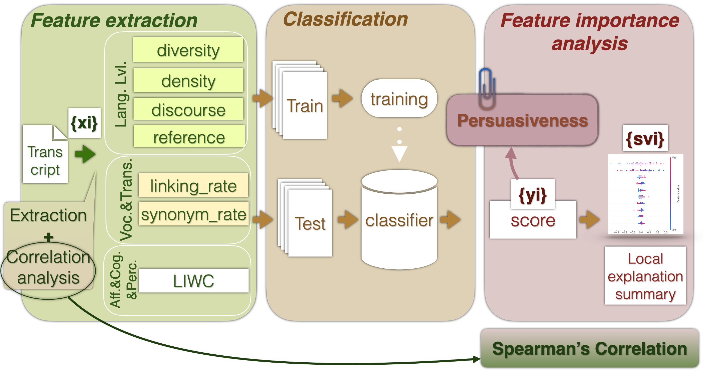

.. Public Speaking Automatic Assessment with AudioTextual Features documentation master file, created by
   sphinx-quickstart on Wed Jun 26 18:23:30 2024.
   You can adapt this file completely to your liking, but it should at least
   contain the root `toctree` directive.

Welcome to Public Speaking Automatic Assessment with AudioTextual Features's documentation!
===========================================================================================

Introduction
------------

This documentation provides an overview of the Public Speaking Automatic Assessment with AudioTextual Features project.

**Project Overview**

This project aims to automatically assess public speaking performances using audio and textual features. Analysis use classical ML models for classification and regression.

Features
--------

- **Audio Features**: Utilizes eGeMAPs feature set.
- **Textual Features**: POSTag and LIWC feature set described in Barkar2023.pdf.

.. toctree::
   :maxdepth: 2
   :caption: Contents:

   modules
   project_structure
   project_config

Indices and tables
==================

* :ref:`genindex`
* :ref:`modindex`
* :ref:`search`
